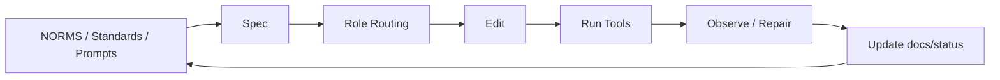

# Generalrule Baseline

This repository is the "official path baseline + one-command initializer" used to graft governance standards onto any new project.

See the detailed usage guide in [docs/USAGE.md](./docs/USAGE.md).

## Task-Level Constrained Flow



## Repository Responsibilities

1. Maintain the official runtime configuration under `.codex/`.
2. Maintain the initializer asset source in `bootstrap/assets/`.
3. Generate the target project skeleton from seed data with `scripts/init-project.sh`.
4. Prevent regressions in the baseline and generation flow through `tests/unit/*`.

## Baseline Source of Truth in This Repository

- `.codex/config.toml`
- `.codex/rules/default.rules`
- `.agents/skills/`
- `AGENTS.md`
- `docs/NORMS.md`
- `docs/standards/*`
- `docs/prompts/*`
- `seed.template.md`
- `bootstrap/assets/`
- `scripts/init-project.sh`

## Skill Usage

Default behavior:

- `vibe-governance` is triggered as the main workflow implicitly.
- During requirement confirmation and technical selection, the `brainstorming` skill is called first by default to converge on the approach.

Explicit triggers when needed:

- `$vibe-governance`
- `$vibe-task-pack`
- `$vibe-quality-gates`

## Governance Layers

1. `docs/NORMS.md`: the shortest hard-rule source of truth
2. `docs/standards/*`: long-term standards for discovery, design, planning, coding, testing, security, observability, release, and documentation
3. `docs/prompts/*`: reusable role prompt assets
4. `spec/design/plan/contract/current-task/handoff`: task-level truth
5. `scripts/ci/* + CI`: final hard gates

`handoff` is now validated at a finer granularity: it must include fixed sections, the current/next role prompt paths, the current/next role standards, the primary artifact link the current role must deliver, and an evidence summary.

## Generate a New Project

```bash
bash scripts/init-project.sh   --output /absolute/path/to/new-project   --seed ./seed.template.md
```

For production `full` projects, strict seed mode is recommended:

```bash
STRICT_SEED=1 bash scripts/init-project.sh   --output /absolute/path/to/new-project   --seed ./seed.template.md
```

## Key Assets Added After Generation

- `docs/NORMS.md`
- `docs/standards/coding-standards.md`
- `docs/standards/discovery-standards.md`
- `docs/standards/design-standards.md`
- `docs/standards/planning-standards.md`
- `docs/standards/release-standards.md`
- `docs/standards/documentation-standards.md`
- `docs/standards/testing-standards.md`
- `docs/standards/security-standards.md`
- `docs/standards/observability-standards.md`
- `docs/prompts/*.md`
- `docs/governance/ROLE_STANDARD_MATRIX.md`
- `docs/governance/TASK_TYPE_STANDARD_PROFILES.md`
- `docs/governance/EXCEPTIONS.md`
- `docs/metrics/ENGINEERING_METRICS.md`
- `docs/status/TEMPLATE-exception-log.md`
- `docs/status/TEMPLATE-metrics-weekly.md`
- `.pre-commit-config.yaml`
- `scripts/dev/install-pre-commit.sh`
- `scripts/ci/validate-exception-gate.sh`
- `scripts/ci/collect-metrics.sh`

## Official Codex Configuration

This repository already enables project-level configuration in the official way:

- `.codex/config.toml`
- `.codex/rules/default.rules`

`.codex/config.toml` declares the project-level `spec-workflow` MCP by default:

- `[mcp_servers.spec-workflow]`
- `command = "bash"`
- `args = [".codex/bin/spec-workflow.sh", "."]`
- `env = { SPEC_WORKFLOW_HOME = ".spec-workflow-mcp" }`
- `startup_timeout_sec = 180`

## Production-Grade Hardening

The current baseline includes layered gate strategies:

- Hard blocks: permissions, security, release, exception handling, contract consistency
- Tiered blocking: `standards-binding` defaults to `strict`; any role missing standards binding or evidence is blocked unless `STANDARDS_ENFORCEMENT=mixed|warn` is set explicitly
- Soft blocks: observability and maintenance records
- Documentation hard block: citation quality for spec/design/adr/prd
- Earlier blocking: `pre-push + pre-commit + CI`
