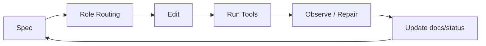

# Generalrule Baseline

这个仓库是“官方路径基线 + 一键初始化器”，用于把治理规范嫁接到任意新项目。

详细使用说明见：[docs/USAGE.md](./docs/USAGE.md)。

## 任务级强约束流程



## 仓库职责

1. 维护官方路径运行时配置（`.codex/`）。
2. 维护初始化资产源（`bootstrap/assets/`）。
3. 通过 `scripts/init-project.sh` 根据 seed 生成目标项目骨架。
4. 通过 `tests/unit/*` 保证基线与生成流程不退化。

## 基线真值（本仓库）

- `.codex/config.toml`
- `.codex/rules/default.rules`
- `.agents/skills/`
- `AGENTS.md`
- `seed.template.md`
- `bootstrap/assets/`
- `scripts/init-project.sh`

## Skills 使用

默认行为：

- `vibe-hub` 会作为主流程自动触发（隐式）

显式触发（按需）：

- `$vibe-hub`（推荐：单入口）
- `$vibe-governance`（兼容：直接治理流程）
- `$vibe-task-pack`
- `$vibe-quality-gates`

本地脚本调用：

```bash
bash .agents/skills/vibe-hub/scripts/run.sh start \
  --goal "做一个让新用户 10 分钟内完成首次发布的流程" \
  --task-type feature \
  --work-type full \
  --spec-id SPEC-0001-core-flow

bash .agents/skills/vibe-hub/scripts/run.sh status
bash .agents/skills/vibe-hub/scripts/run.sh gates

# 兼容：保留原子技能调用
bash .agents/skills/vibe-task-pack/scripts/new-task-pack.sh \
  --spec-id SPEC-0001-core-flow \
  --task-type feature \
  --current-role Dev \
  --next-role QA

bash .agents/skills/vibe-quality-gates/scripts/run-local-gates.sh
```

## 对话级步骤回报

默认每一步会输出结构化回报块：

```text
[step-report]
- STEP_ID: ...
- STEP_NAME: ...
- ACTIONS: ...
- FILES_CREATED: ...
- FILES_UPDATED: ...
- COMMANDS_RUN: ...
- GATE_STATUS: pass|fail|warn|skip
- RESULT_SUMMARY: ...
- NEXT_ACTION: ...
```

开关：

- `STEP_REPORT_MODE=detailed`（默认）
- `STEP_REPORT_MODE=minimal`
- `STEP_REPORT_MODE=off`（仅软约束脚本可关闭；硬约束脚本会自动降级为 minimal）

黑盒半自动（你只给一句话目标）：

```bash
bash .agents/skills/vibe-hub/scripts/run.sh start \
  --goal "做一个让新用户 10 分钟内完成首次发布的流程" \
  --task-type feature \
  --work-type full \
  --spec-id SPEC-0001-core-flow

bash .agents/skills/vibe-hub/scripts/run.sh status
# 兼容：仍可直接使用 run-blackbox-flow approve --gate "Gate 2|Gate 3|发布"
bash .agents/skills/vibe-governance/scripts/run-blackbox-flow.sh approve --gate "Gate 2"
bash .agents/skills/vibe-governance/scripts/run-blackbox-flow.sh approve --gate "Gate 3"
bash .agents/skills/vibe-governance/scripts/run-blackbox-flow.sh approve --gate "发布"
```

## 生成新项目

```bash
bash scripts/init-project.sh \
  --output /absolute/path/to/new-project \
  --seed ./seed.template.md
```

覆盖非空目录：

```bash
bash scripts/init-project.sh \
  --output /absolute/path/to/new-project \
  --seed ./seed.template.md \
  --force
```

默认启用严格 seed 校验（`full` 项目会强制 L2）：

```bash
bash scripts/init-project.sh \
  --output /absolute/path/to/new-project \
  --seed ./seed.template.md
```

迁移期兼容模式（仅在补齐 seed 前临时使用）：

```bash
STRICT_SEED=0 bash scripts/init-project.sh \
  --output /absolute/path/to/new-project \
  --seed ./seed.template.md
```

## 生成后默认结构

- `.codex/config.toml`
- `.codex/rules/default.rules`
- `AGENTS.md`
- `.agents/skills/vibe-hub/SKILL.md`
- `.agents/skills/vibe-hub/scripts/run.sh`
- `.agents/skills/vibe-governance/SKILL.md`
- `.agents/skills/vibe-governance/scripts/run-blackbox-flow.sh`
- `.agents/skills/vibe-task-pack/SKILL.md`
- `.agents/skills/vibe-quality-gates/SKILL.md`
- `.github/CODEOWNERS`
- `.github/PULL_REQUEST_TEMPLATE.md`
- `.github/workflows/ci.yml`
- `.github/workflows/security.yml`
- `.github/workflows/release.yml`
- `.github/workflows/scheduled-maintenance.yml`
- `docs/prd/0001-problem-statement.md`
- `docs/design/0001-architecture-overview.md`
- `docs/adr/0001-initial-decision.md`
- `docs/governance/BRANCH_PROTECTION.md`
- `docs/governance/ROLE_ROUTING.md`
- `docs/governance/STEP_REPORTING.md`
- `docs/plans/0001-implementation-plan.md`
- `docs/test-plan/0001-test-plan.md`
- `docs/specs/TEMPLATE-feature-spec.md`
- `docs/contracts/TEMPLATE-api-frontend-map.md`
- `docs/runbooks/incident-playbook.md`
- `docs/runbooks/backup-restore.md`
- `docs/runbooks/oncall-checklist.md`
- `docs/metrics/TEMPLATE-dora-aarrr.md`
- `docs/status/TEMPLATE-weekly-maintenance.md`
- `docs/status/TEMPLATE-monthly-maintenance.md`
- `docs/status/TEMPLATE-role-handoff.md`
- `docs/status/TEMPLATE-blackbox-session.md`
- `docs/release/CHANGELOG.md`
- `docs/release/RELEASE_NOTES.md`
- `docs/status/current-task.md`
- `.githooks/pre-push`
- `.githooks/pre-commit`
- `scripts/ci/check-codex-capabilities.sh`
- `scripts/ci/validate-preflight-gate.sh`
- `scripts/lib/step-report.sh`
- `scripts/ci/validate-spec-pack.sh`
- `scripts/ci/validate-role-flow.sh`
- `scripts/ci/validate-api-frontend-sync.sh`
- `scripts/ci/validate-governance.sh`
- `scripts/ci/validate-doc-links.sh`
- `scripts/ci/validate-permissions-gate.sh`
- `scripts/ci/validate-security-gate.sh`
- `scripts/ci/validate-release-readiness.sh`
- `scripts/ci/validate-observability-gate.sh`
- `scripts/dev/install-hooks.sh`

## 官方 Codex 配置

当前仓库已按官方方式启用项目级配置：

- `.codex/config.toml`
- `.codex/rules/default.rules`

Profile 示例：

- `codex --profile strict`
- `codex --profile release`

官方能力门槛（严格模式）：

- 必须支持 `codex execpolicy check --rules ...`
- 必须支持 `prefix_rule(..., justification = "...")`
- 不满足能力门槛时本地与 CI 都阻断

本地检查命令：

- `bash scripts/ci/check-codex-capabilities.sh`

规则验证示例：

- `codex execpolicy check --pretty --rules .codex/rules/default.rules -- git reset --hard`
- `codex execpolicy check --pretty --rules .codex/rules/default.rules -- git status`

## 生产级加固能力

当前基线已内置分级门禁策略：

- 硬阻断：权限（CODEOWNERS + 审批元数据）、安全（secret/dependency/policy）、发布就绪检查
- 软阻断（告警）：观测与维护记录（可切 strict）

新增核心资产位于 `bootstrap/assets`：

- `.agents/skills/vibe-governance/*`
- `.agents/skills/vibe-task-pack/*`
- `.agents/skills/vibe-quality-gates/*`
- `.agents/skills/vibe-hub/*`
- `.github/CODEOWNERS`
- `.github/workflows/security.yml`
- `.github/workflows/release.yml`
- `.github/workflows/scheduled-maintenance.yml`
- `docs/governance/ROLE_ROUTING.md`
- `docs/specs/TEMPLATE-feature-spec.md`
- `docs/contracts/TEMPLATE-api-frontend-map.md`
- `docs/status/TEMPLATE-role-handoff.md`
- `.githooks/pre-push`
- `scripts/ci/validate-permissions-gate.sh`
- `scripts/ci/validate-security-gate.sh`
- `scripts/ci/validate-release-readiness.sh`
- `scripts/ci/validate-observability-gate.sh`
- `scripts/ci/validate-spec-pack.sh`
- `scripts/ci/validate-role-flow.sh`
- `scripts/ci/validate-api-frontend-sync.sh`
