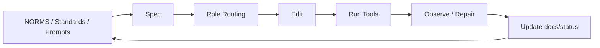

# Generalrule Baseline

这个仓库是“官方路径基线 + 一键初始化器”，用于把治理规范嫁接到任意新项目。

详细使用说明见：[docs/USAGE.md](./docs/USAGE.md)。

## 任务级强约束流程



## 仓库职责

1. 维护官方路径运行时配置（`.codex/`）。
2. 维护初始化资产源（`bootstrap/assets/`）。
3. 通过 `scripts/init-project.sh` 根据 seed 生成目标项目骨架。
4. 通过 `tests/unit/*` 保证基线与生成流程不退化。

## 基线真值（本仓库）

- `.codex/config.toml`
- `.codex/rules/default.rules`
- `.agents/skills/`
- `AGENTS.md`
- `docs/NORMS.md`
- `docs/standards/*`
- `docs/prompts/*`
- `seed.template.md`
- `bootstrap/assets/`
- `scripts/init-project.sh`

## Skills 使用

默认行为：

- `vibe-governance` 会作为主流程自动触发（隐式）
- 在需求确认与技术选型阶段，默认先调用 `brainstorming` skill 辅助收敛

显式触发（按需）：

- `$vibe-governance`（可手动强制进入主流程）
- `$vibe-task-pack`
- `$vibe-quality-gates`

## 规范层级

1. `docs/NORMS.md`：最短硬规则真值
2. `docs/standards/*`：discovery/design/planning/coding/testing/security/observability/release/documentation 长期标准
3. `docs/prompts/*`：角色提示资产
4. `spec/design/plan/contract/current-task/handoff`：任务级真值
5. `scripts/ci/* + CI`：最终硬门禁

其中 `handoff` 现在是细粒度校验对象：必须包含固定章节、当前/下一角色 prompt 路径、当前/下一角色 standards、当前角色应交付的主产物链接，以及证据摘要。

## 生成新项目

```bash
bash scripts/init-project.sh \
  --output /absolute/path/to/new-project \
  --seed ./seed.template.md
```

正式 `full` 项目建议启用 strict seed：

```bash
STRICT_SEED=1 bash scripts/init-project.sh \
  --output /absolute/path/to/new-project \
  --seed ./seed.template.md
```

## 生成后新增的关键资产

- `docs/NORMS.md`
- `docs/standards/coding-standards.md`
- `docs/standards/discovery-standards.md`
- `docs/standards/design-standards.md`
- `docs/standards/planning-standards.md`
- `docs/standards/release-standards.md`
- `docs/standards/documentation-standards.md`
- `docs/standards/testing-standards.md`
- `docs/standards/security-standards.md`
- `docs/standards/observability-standards.md`
- `docs/prompts/*.md`
- `docs/governance/ROLE_STANDARD_MATRIX.md`
- `docs/governance/TASK_TYPE_STANDARD_PROFILES.md`
- `docs/governance/EXCEPTIONS.md`
- `docs/metrics/ENGINEERING_METRICS.md`
- `docs/status/TEMPLATE-exception-log.md`
- `docs/status/TEMPLATE-metrics-weekly.md`
- `.pre-commit-config.yaml`
- `scripts/dev/install-pre-commit.sh`
- `scripts/ci/validate-exception-gate.sh`
- `scripts/ci/collect-metrics.sh`

## 官方 Codex 配置

当前仓库已按官方方式启用项目级配置：

- `.codex/config.toml`
- `.codex/rules/default.rules`

其中 `.codex/config.toml` 默认声明项目级 `spec-workflow` MCP：

- `[mcp_servers.spec-workflow]`
- `command = "bash"`
- `args = [".codex/bin/spec-workflow.sh", "."]`
- `env = { SPEC_WORKFLOW_HOME = ".spec-workflow-mcp" }`
- `startup_timeout_sec = 180`

## 生产级加固能力

当前基线已内置分级门禁策略：

- 硬阻断：权限、安全、发布、exception、契约一致性
- 分级阻断：`standards-binding` 默认 `strict`，所有角色缺标准绑定或缺证据都会阻断；需要降级时显式设 `STANDARDS_ENFORCEMENT=mixed|warn`
- 软阻断（告警）：观测与维护记录
- 文档依据硬阻断：spec/design/adr/prd 的 citation quality
- 更早阻断：`pre-push + pre-commit + CI`
